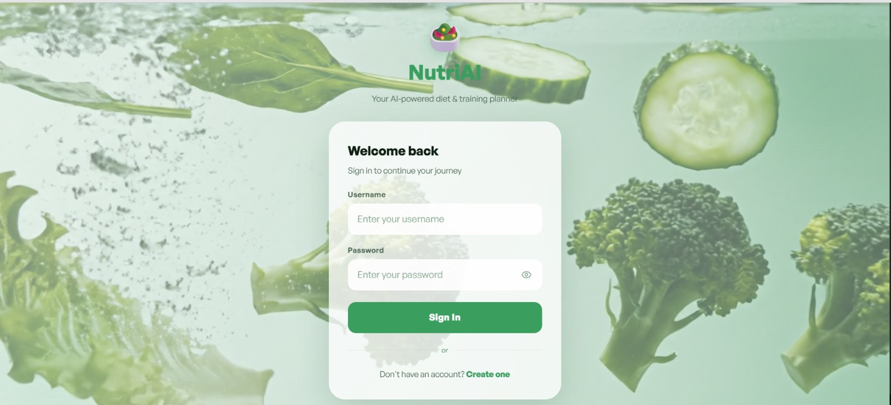
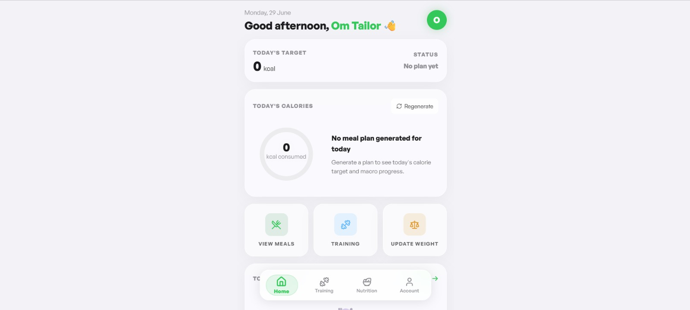
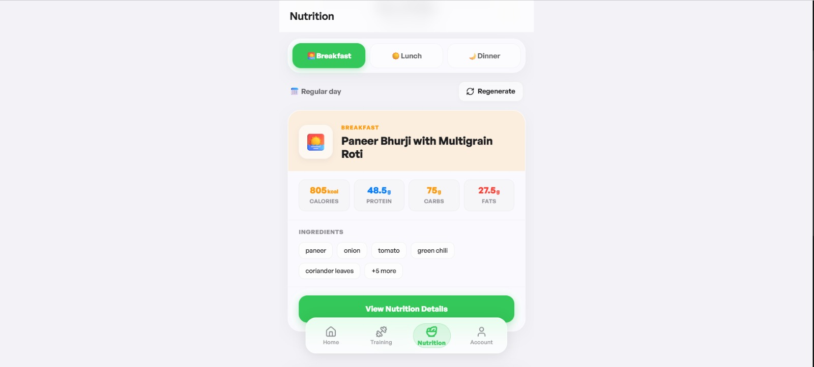
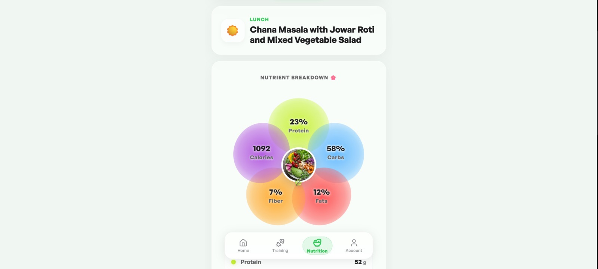
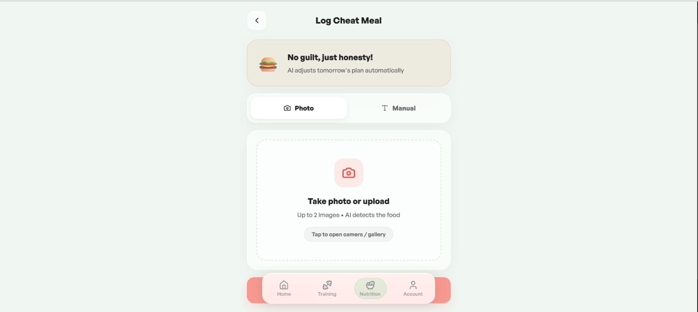
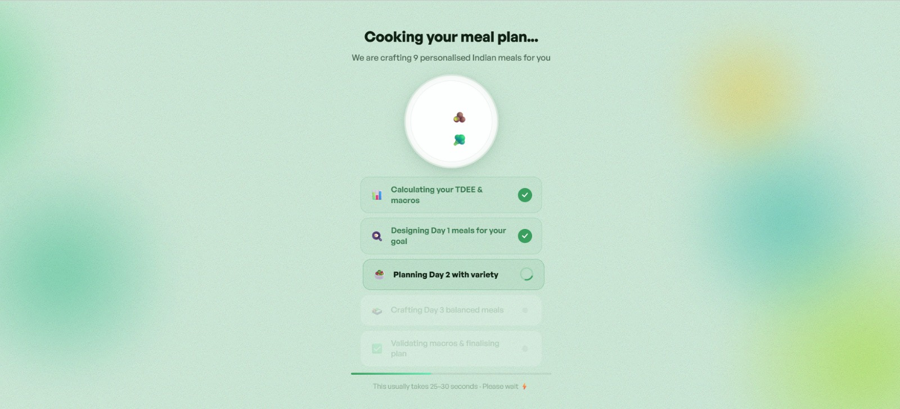
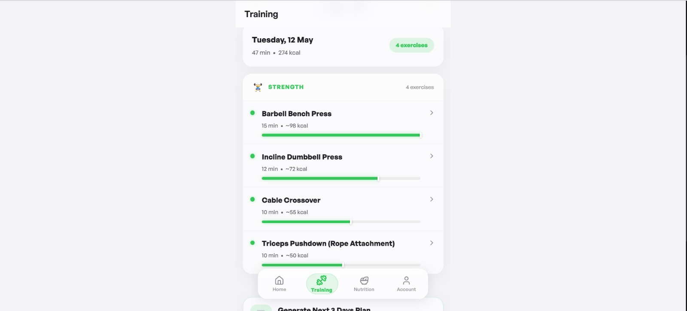

<div align="center">

<br/>


<h1>NutriAI</h1>

<p><strong>AI-powered Indian meal & fitness planner — personalized, validated, beautiful.</strong></p>

<p>
  <a href="https://diet-planner-three-sable.vercel.app/login" target="_blank">
    
  </a>
  &nbsp;
  <a href="https://www.linkedin.com/in/om-tailor-ba72b8310/" target="_blank">
    
  </a>
</p>

<p>
  
  
  
  
  
</p>

<br/>

</div>

***

## 📸 Screenshots

<br/>

**🔐 Auth Page** — Glassmorphic sign-in with animated food background and JWT authentication



<br/><br/>

**👤 Onboarding Wizard** — 6-step flow capturing 19 profile fields (personal details, body stats, goals, diet, beverages, fasting & gym)


<br/><br/>

**🏠 Dashboard** — Today's calorie ring, macro bars, BMI card, weight trend, and quick actions



<br/><br/>

**🍽️ Nutrition Page** — Swipeable date strip with breakfast / lunch / dinner cards and PDF export



<br/><br/>

**🛒 Grocery List** — Per-ingredient quantities aggregated across meal slots with date-range filtering


<br/><br/>

**🥗 Meal Details** — Interactive 5-macro flower UI (protein, carbs, fats, fiber, calories) with ingredient breakdown



<br/><br/>

**🍩 Cheat Meal** — Log by image or text, AI macro estimate with confidence, follow-up Q&A, and automatic re-balancing



<br/><br/>

**🔥 Cooking Loader** — Animated generation screen with playful progress steps



<br/><br/>

**🏋️ Training Plan** — Weekly workout schedule with day notes, sets/reps/rest, and PDF export



<br/>

***

## ✨ Features

### 🧠 AI Generation
- **Gemini 2.5 Flash** generates fully personalized 3-day Indian meal plans — 9 unique meals across breakfast, lunch, and dinner
- **Pydantic v2** validates every AI response — malformed or incomplete outputs never reach the user
- **2-model fallback chain** (`gemini-2.5-flash-lite` → `gemini-2.5-flash`) with retries and escalating backoff keeps generation resilient
- **Per-day regeneration** — refresh any single day independently; the AI avoids repeating previously used meal names
- **Fasting-aware menus** — days matching the user's fasting schedule get ingredient-constrained, fasting-safe meals
- **Training plans** generated from the same profile — a weekly schedule with exercise breakdowns and day notes

### 👤 6-Step Onboarding Wizard

```
Personal → Body Stats → Goals & Diet → Beverages → Fasting & Gym → Summary
```

| Step | What you choose |
|------|----------------|
| 🙋 Personal Details | Name, age, city, gender |
| 📏 Body Stats | Height, current weight, target weight, daily health time |
| 🎯 Goals & Diet | Goal (Muscle Building / Fat Loss / Weight Loss / Maintenance) + Diet (Jain / Veg / Non-Veg) |
| ☕ Beverages | Tea / coffee habit, type, morning & evening preference |
| 🙏 Fasting & Gym | Fasting days & type (e.g. Ekadashi, Navratri) + gym routine |
| ✅ Summary | Review every field before generating your plan |

**19 profile fields** collected across **5 modular Django apps** (`users`, `meals`, `cheat_meals`, `grocery`, `training`).

### ⚖️ Calorie Engine
- **TDEE** computed via the **Mifflin-St Jeor** BMR formula (gender-specific coefficients)
- **5 activity multipliers** (1.2 → 1.725) derived from daily health minutes, not guesses
- **Goal adjustments** — Fat Loss −300, Weight Loss −600, Muscle Building +300, Maintenance 0
- **Beverage calories** deducted before the meal budget is split 30/40/30 (loss) or 28/38/34 (build)
- **Protein targets** scale with body weight (1.2–1.8 g/kg, +0.1 g/kg if age > 40) with per-goal fat ceilings

### 🍩 Smart Cheat Meal Loop
- Log a cheat meal via **image upload** (multimodal) or **text description**
- **2-round AI follow-up Q&A** — Gemini asks one clarifying question when the portion is ambiguous
- **3-level size classification** with confidence scoring (Small / Medium / Large)
- **Automatic re-balancing** — upcoming days are adjusted to compensate, and the grocery list is flagged for refresh

### 📊 Nutrition Dashboard & Grocery
- Per-meal nutrition visualized as an interactive **5-macro flower** (protein, carbs, fats, fiber, calories) across 3 meal slots
- Ingredient-by-ingredient breakdown with servings and **diet tags** (Jain / fasting-friendly)
- **Dynamic grocery lists** — per-ingredient quantities aggregated across all meal slots, aliases merged (e.g. "tomato puree" → "Tomato"), with **date-range filtering** and check-off tracking
- **Export to PDF** for any meal day

### ⚡ Performance & Reliability
- **Bulk DB inserts** replace individual writes per plan (~78% fewer DB operations)
- **Batch endpoints** fetch multiple days in a single request — no N+1 HTTP calls
- Grocery generation runs on a **background thread** after plan creation so the API responds instantly
- Dedicated **performance indexes**, `select_related` / `prefetch_related`, persistent DB connections, gzip compression, and skeleton loaders

### 🔐 Authentication
- JWT-based auth (access + refresh tokens with **rotation and blacklisting**)
- Sign In / Sign Up with animated crossfading travel backgrounds
- 6-step onboarding gating — plans unlock only once the profile is complete

***

## 🛠️ Tech Stack

| Layer | Technology |
|-------|-----------|
| **Backend** | Django 6, Django REST Framework |
| **Frontend** | React 19, Framer Motion, Vite, Tailwind CSS |
| **Database** | PostgreSQL (Neon) |
| **AI** | Google Gemini API (`gemini-2.5-flash` / `gemini-2.5-flash-lite`) |
| **Validation** | Pydantic v2 |
| **Auth** | JWT — djangorestframework-simplejwt |
| **Static Files** | Whitenoise |
| **Deployment** | Render (backend) + Vercel (frontend) |

***

## 🚀 Local Setup

### Prerequisites
- Python 3.11+
- Node.js 18+
- PostgreSQL (Neon free tier works out of the box)

### 1. Clone the repo

```bash
git clone https://github.com/Omtailor/diet_planner.git
cd diet_planner
```

### 2. Backend setup

```bash
cd backend

# Create and activate virtual environment
python -m venv venv
venv\Scripts\activate        # Windows — macOS/Linux: source venv/bin/activate

# Install dependencies
pip install -r requirements.txt

# Create .env file and fill in your values
cp .env.example .env

# Run migrations
python manage.py migrate

# Seed the food database
python manage.py seed_food

# Start the server
python manage.py runserver
```

### 3. Frontend setup

```bash
cd frontend
npm install

# Point the API at your local backend
cp .env.example .env.development
npm run dev
```

Open `http://localhost:5173`, create an account, complete the 6-step onboarding, and generate your first plan.

### Environment Variables

Create a `.env` file in `backend/`:

```env
# Django
SECRET_KEY=your_django_secret_key
DEBUG=True
DJANGO_ENV=development

# Database
DB_NAME=nutriai
DB_USER=your_db_user
DB_PASSWORD=your_db_password
DB_HOST=your_db_host
DB_PORT=5432

# Gemini AI
GEMINI_API_KEY=your_gemini_api_key

# CORS & Hosts
ALLOWED_HOSTS=localhost,127.0.0.1
CORS_ALLOWED_ORIGINS=http://localhost:5173
DJANGO_ADMIN_URL=admin
```

And a `frontend/.env.development`:

```env
VITE_API_BASE_URL=http://127.0.0.1:8000/api
```

***

## 📁 Project Structure

```
DietPlanner/
├── backend/                    # Django REST API
│   ├── core/                   # Settings, URLs, security middleware
│   ├── users/                  # Auth — JWT login, signup, onboarding profile
│   ├── meals/                  # Core app — meal plans + Gemini generation
│   │   ├── meal_generator.py   # Prompt builder + TDEE engine + Gemini calls
│   │   ├── schemas.py          # Pydantic v2 validation models
│   │   └── management/commands/seed_food.py
│   ├── cheat_meals/            # Image/text AI analysis + calorie adjustment
│   ├── grocery/                # Aggregated grocery list generation
│   ├── training/               # Weekly training plan generation
│   ├── manage.py
│   ├── requirements.txt
│   ├── .env.example
│   ├── build.sh
│   └── render.yaml
├── frontend/                   # React app (Vite + Tailwind + Framer Motion)
│   └── src/
│       ├── pages/              # Auth, Dashboard, Nutrition, CheatMeal, Training, Account
│       ├── components/         # Onboarding steps, macro flower, cooking loader
│       ├── context/            # Auth context
│       ├── hooks/              # Custom React hooks
│       ├── services/           # Axios API layer
│       └── utils/              # Constants, validation, PDF export
└── assets/                     # Screenshots used in this README
```

***

## ⚖️ Calorie Engine Logic

| Factor | How it's applied |
|--------|------------------|
| **BMR** | Mifflin-St Jeor — gender-specific coefficients |
| **Activity multiplier** | 5 bands from daily health minutes (1.2 → 1.725) |
| **Goal adjustment** | Fat Loss −300 · Weight Loss −600 · Muscle Building +300 · Maintenance 0 |
| **Beverage calories** | Deducted from TDEE before the meal split |
| **Meal split** | Breakfast / Lunch / Dinner — 30/40/30 (loss) · 28/38/34 (build) |
| **Protein** | 1.2–1.8 g/kg bodyweight (+0.1 g/kg if age > 40) |
| **Fat ceiling** | 55 g/day (loss goals) · 85 g/day (build goals) |

***

## 🍩 Cheat Meal Adjustment Logic

Enforced after every cheat meal — the deficit is spread across upcoming days:

| Size | Threshold | Days adjusted |
|------|-----------|---------------|
| **Small** | ≤ 300 kcal | 2 upcoming days |
| **Medium** | 300 – 700 kcal | 4 upcoming days |
| **Large** | > 700 kcal | 7 upcoming days |

Each affected day is marked `adjusted`, receives a note explaining the reduction, and the grocery list is flagged for refresh.

***

## 🧩 AI Response Validation

Every Gemini response is parsed and validated against a strict **Pydantic v2 schema** before being stored or returned:

- ✅ All 9 meals (3 days × 3 slots) with 5–10 ingredients each must parse cleanly
- ✅ Macro math is checked — `calories ≈ protein×4 + carbs×4 + fats×9` (tight ±25 kcal guidance to the model)
- ✅ Unrealistic values clamped server-side — 65 g protein / 45 g fat / 1200 kcal max per meal
- ✅ Fiber, serving size, and diet flags are **computed server-side** — never trusted from Gemini
- ✅ Fasting-day and Jain-friendly tags derived from the user's profile context
- ✅ On validation failure → the **2-model fallback chain** retries before surfacing an error

***

## 📦 Deployment

| Service | Provider | Notes |
|---------|----------|-------|
| Frontend | **Vercel** | Auto-deploys on push |
| Backend | **Render** | Gunicorn + Whitenoise |
| PostgreSQL | **Neon** | Free tier, SSL required |

***

## 👤 Author

**Om Tailor** — AIML Student, Mumbai

> **Note:** This project is currently unlicensed. An **MIT license** is recommended before publishing.

***

<div align="center">
  <sub>Built with ❤️ and too many Gemini API calls</sub>
</div>
